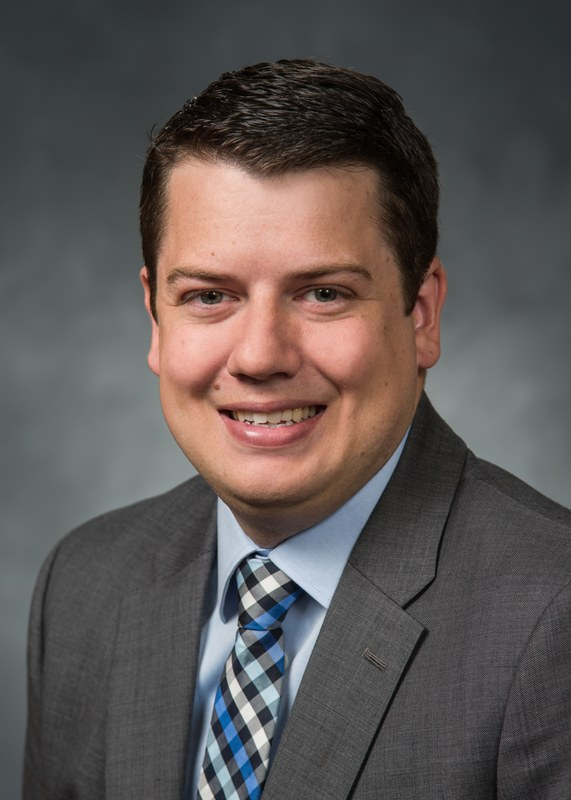

---
hide:
    - navigation
---

<!-- Generated by build_faculty_page.py from cv_data.yml. Do not edit by hand;
     your changes will be overwritten on the next `make faculty-page`. -->

# Jeffrey Goeders

[:octicons-arrow-left-24: Back to Directory](/)

=== "Overview"
    ## Overview

    

        
    

    **Jeffrey Goeders** is an Associate Professor in the Department of Electrical and Computer Engineering at Brigham Young University, where he has been on the faculty since 2016.  His research is in computer-aided design for FPGAs and reconfigurable computing, spanning high-level synthesis, hardware debug, hardware security, and the reliability of FPGA and system-on-chip devices in radiation environments.  More recently his group has worked on applying large language models to hardware design and verification.

    He received his Ph.D. from the University of British Columbia in 2016, where he worked with Steve Wilton on techniques for in-system, observation-based debug of high-level synthesis circuits on FPGAs.  He is a Senior Member of both the IEEE and the ACM, and serves the reconfigurable computing community as General Chair of FCCM 2027 and as Information Director for ACM Transactions on Reconfigurable Technology and Systems.

    [Google Scholar](https://scholar.google.com/citations?user=mSyX_kYAAAAJ&hl=en) &nbsp;&nbsp;
    [Configurable Computing Lab](https://ccl.byu.edu/) &nbsp;&nbsp;
    [GitHub](https://github.com/jgoeders)

    ### Contact
    - **Email:** [jgoeders@byu.edu](mailto:jgoeders@byu.edu)
    - **Phone:** 801-422-3499
    - **Office:** 450I Engineering Building
    - **Department:** Department of Electrical and Computer Engineering, Brigham Young University

    ### Education
    - Ph.D., Computer Engineering, The University of British Columbia, 2016
    - M.A.Sc., Computer Engineering, The University of British Columbia, 2012
    - B.A.Sc. with Honors, Computer Engineering, University of Toronto, 2010

=== "Publications"
    ## Publications

    ### Book Chapters
    - **Jeffrey Goeders**, Graham M. Holland, Lesley Shannon, and Steven J.E. Wilton, "Systems-on-Chip on FPGAs", *FPGAs for Software Programmers*, Springer, 2016.
    - Andrew Canis, Jongsok Choi, Blair Fort, Bain Syrowik, Ruo Long Lian, Yu Ting Chen, Hsuan Hsiao, **Jeffrey Goeders**, Stephen Brown, and Jason Anderson, "LegUp high-level synthesis", *FPGAs for Software Programmers*, Springer, 2016.

    ### Peer-Reviewed Journal Articles
    - Mohamed A Elgammal, Amin Mohaghegh, Soheil Gholami Shahrouz, Fatemehsadat Mahmoudi, Fahrican Koşar, Kimia Talaei, Joshua Fife, Daniel Khadivi, Kevin Murray, Andrew Boutros, Kenneth B Kent, **Jeffrey Goeders**, and Vaughn Betz, "VTR 9: Open-source CAD for fabric and beyond FPGA architecture exploration", *ACM Transactions on Reconfigurable Technology and Systems (TRETS)*, Aug 2025.
    - **Jeffrey Goeders**, Weston Smith, Maria Kastriotou, Michael Wirthlin, "A Parallelized Neutron Radiation Testing Technique to Understand Failures Within a Complex SoC", *IEEE Transactions on Nuclear Science*, March 2025.
    - Daniel Hutchings, Adam Taylor, and **Jeffrey Goeders**, "Toward FPGA Intellectual Property (IP) Encryption from Netlist to Bitstream", *ACM Transactions on Reconfigurable Technology and Systems (TRETS)*, Dec 2024.
    - Nathan Harris, Wesley Stirk, Dolores Black, Jeff Black, Michael Wirthlin, and **Jeffrey Goeders**, "Dynamic Testing of a Commercial FRAM Device Under Gamma Ray Dose and Neutron Beam", *IEEE Transactions on Nuclear Science (TNS)*, Mar 2024.
    - Wesley Stirk, Dolores A. Black, Jeffrey D. Black, Matthew Breeding, Roy P. Cuoco, Mike Wirthlin, and **Jeffrey Goeders**, "The Effects of Gamma Ray Integrated Dose on a Commercial 65-nm SRAM Device", *IEEE Transactions on Nuclear Science (TNS)*, Jun 2023.
    - Wesley Stirk, Evan Poff, Jackson Smith, **Jeffrey Goeders**, and Michael Wirthlin, "Comparison of Neutron Radiation Testing Approaches for a Complex SoC", *IEEE Transactions on Nuclear Science (TNS)*, Jan 2023.
    - Hayden Cook, Jacob Arscott, Brent George, Tanner Gaskin, **Jeffrey Goeders**, and Brad Hutchings, "Inducing Non-Uniform FPGA Aging Using Configuration-Based Short Circuits", *ACM Transactions on Reconfigurable Technology and Systems (TRETS)*, vol. 15, no. 4, pp.1-33, Jun 2022.
    - Eli Cahill, Brad Hutchings and **Jeffrey Goeders**, "Approaches for FPGA Design Assurance", *ACM Transactions on Reconfigurable Technology and Systems (TRETS)*, vol. 15, no. 3, pp.1-29, Dec 2021.
    - Benjamin James, Michael Wirthlin, and **Jeffrey Goeders**, "Investigating How Software Characteristics Impact the Effectiveness of Automated Software Fault Tolerance", *IEEE Transactions on Nuclear Science (TNS)*, vol. 68, no. 5, pp. 1014-1022, Apr 2021.
    - Al-Shahna Jamal, Eli Cahill, **Jeffrey Goeders**, and Steven JE Wilton, "Fast Turnaround HLS Debugging using Dependency Analysis and Debug Overlays", *ACM Transactions on Reconfigurable Technology and Systems (TRETS)*, vol. 13, no. 1, pp. 1-26, Feb 2020.
    - Benjamin James, Heather Quinn, Michael Wirthlin, and **Jeffrey Goeders**, "Applying Compiler-Automated Software Fault Tolerance to Multiple Processor Platforms", *IEEE Transactions on Nuclear Science (TNS)*, vol. 67, no. 1, pp. 321-327, Jan 2020.
    - Matthew Bohman, Benjamin James, Michael Wirthlin, Heather Quinn, and **Jeffrey Goeders**, "Microcontroller Compiler-Assisted Software Fault Tolerance", *IEEE Transactions on Nuclear Science (TNS)*, vol. 66, no. 1, pp. 223-232, Jan 2019.
    - **Jeffrey Goeders**, and Steven J.E. Wilton, "Signal-Tracing Techniques for In-System FPGA Debugging of High-Level Synthesis Circuits", *IEEE Transactions on Computer-Aided Design of Integrated Circuits and Systems (TCAD)*, vol. 36, no. 1, pp. 83-96, Jan 2017.
    - **Jeffrey Goeders** and Steven J.E. Wilton, "Power Aware Architecture Exploration for Field Programmable Gate Arrays", *Journal of Low Power Electronics (JOLPE)*, vol. 10, no. 3, pp. 297-312, Sep. 2014.
    - Jason Luu, **Jeffrey Goeders**, Michael Wainberg, Andrew Somerville, Thien Yu, Konstantin Nasartschuk, Miad Nasr, Sen Wang, Tim Liu, Nooruddin Ahmed, Kenneth B Kent, Jason Anderson, Jonathan Rose, and Vaughn Betz, "VTR 7.0: Next Generation Architecture and CAD System for FPGAs", *ACM Transactions on Reconfigurable Technology and Systems (TRETS)*, vol 7, no. 2, pp. 6:1–30, Jul 2014.

    ### Peer-Reviewed International Conference Publications
    - Dallin Dahl, Keenan Faulkner, James Usevitch and **Jeffrey Goeders**, "Neurocore: A GNN Approach to Configurable IP Core Identification in FPGA Netlists", *International Conference on Field-Programmable Technology (FPT)*, Dec 2025.
    - Collin Lambert, Jacob Anderson, David Nichols, Parker Allred, Sharisse Poff, **Jeffrey Goeders**, Michael Wirthlin, Shiuh-Hua Wood Chiang, "Open-Source Circuit Radiation Effects (OSCRE) Simulation Framework: Design and Applications", *International Symposium on Circuits and Systems (ISCAS)*, pp. 1-5, May 2025.
    - Jacob Brown, Colton Yates, **Jeffrey Goeders**, Michael Wirthlin, "RarePlanes Detection Using YOLOv5 on the Versal Adaptive SoC", *Aerospace Conference*, pp. 1-9, March 2025.
    - **Jeffrey Goeders**, Dallin Wood, Victoriah Meyer, Cameron Samson, Jeffrey Black, Dolores Black, Mike Wirthlin, "Dose Rate Effects on Dynamic Operation of an 8-bit Microcontroller", *Radiation Effects on Components and Systems Conference (RADECS)*, Sep 2024.
    - Hayden Cook and **Jeffrey Goeders**, "Techniques for Exploring Fine-Grained LUT and Routing Aging on a 28nm FPGA", *International Conference on Field-Programmable Logic and Applications (FPL)*, Sep 2024.
    - Weston Smith, Zachary Driskill, **Jeffrey Goeders**, and Michael Wirthlin, "Digital Design Education Using an Open-Source, Cloud-Based FPGA Toolchain", *Intermountain Engineering, Technology and Computing Conference (i-ETC)*, May 2024.
    - Reilly McKendrick, Keenan Faulkner, and **Jeffrey Goeders**, "Assuring Netlist-to-Bitstream Equivalence using Physical Netlist Generation and Structural Comparison", *International Conference on Field Programmable Technology (FPT)*, Dec 2023.
    - Dallin Dahl, Corey Simpson, Keenan Faulkner, Brent Nelson, and **Jeffrey Goeders**, "IPRec and Isoblaze: Fuzzy Subcircuit Isomorphism for IP Detection in Physical Netlists", *Physical Assurance and Inspection of Electronics Conference (PAINE)*, pp. 26-32, Oct 2023.
    - Hayden Cook, Zephram Tripp, Brad Hutchings, and **Jeffrey Goeders**, "Improving the Reliability of FPGA CRO PUFs", *International Conference on Field-Programmable Logic and Applications (FPL)*, pp. 311-316, Sep 2023.
    - Hayden Cook, Jonathan Thompson, Zephram Tripp, Brad Hutchings, **Jeffrey Goeders**, "Cloning the Unclonable: Physically Cloning an FPGA Ring-Oscillator PUF", *International Conference on Field-Programmable Technology (FPT)*, pp. 1-10, Dec 2022.
    - Reilly McKendrick, Corey Simpson, Brent Nelson, and **Jeffrey Goeders**, "Leveraging FPGA Primitives to Improve Word Reconstruction during Netlist Reverse Engineering", *International Conference on Field-Programmable Technology (FPT)*, pp. 1-5, Dec 2022.
    - Benjamin James, and **Jeffrey Goeders**, "Automated Software Compiler Techniques to Provide Fault Tolerance for Real-Time Operating Systems", *Design, Automation and Test in Europe Conference (DATE)*, Feb 2021.
    - Tanner Gaskin, Hayden Cook, Wesley Stirk, Robert Lucas, **Jeffrey Goeders**, and Brad Hutchings, "Using Novel Configuration Techniques for Accelerated FPGA Aging", *International Conference on Field-Programmable Logic and Applications (FPL)*, Aug 2020.
    - Matthew Ashcraft and **Jeffrey Goeders**, "Synchronizing On-Chip Software and Hardware Traces for HLS-Accelerated Programs", *International Conference on Field Programmable Technology (FPT)*, Dec 2019.
    - Wesley Stirk and **Jeffrey Goeders**, "Implementation and Design Space Exploration of a Turbo Decoder in High-Level Synthesis", *International Conference on Reconfigurable Computing and FPGAs (ReConFig)*, Dec 2019.
    - Daniel Holanda Noronha, Ruizhe Zhao, Zhiqiang Que, **Jeffrey Goeders**, Wayne Luk and Steve Wilton, "An Overlay for Rapid FPGA Debug of Machine Learning Applications", *International Conference on Field Programmable Technology (FPT)*, Dec 2019.
    - Daniel Holanda Noronha, Ruizhe Zhao, **Jeffrey Goeders**, Wayne Luk, and Steven J.E. Wilton, "On-chip FPGA Debug Instrumentation for Machine Learning Applications", *International Symposium on Field-Programmable Gate Arrays (FPGA)*, pp. 110-115, Feb 2019.
    - Matthew Ashcraft and **Jeffrey Goeders**, "Unified On-Chip Software and Hardware Debug for HLS-Accelerated Programs", *International Conference on Field Programmable Technology (FPT)*, pp. 354-357, Dec 2018.
    - Al-Shahna Jamal, **Jeffrey Goeders** and Steve Wilton, "An FPGA Overlay Architecture Supporting Rapid Implementation of Functional Changes during On-Chip Debug", *International Conference on Field Programmable Logic and Applications (FPL)*, Aug 2018.
    - **Jeffrey Goeders**, Tanner Gaskin, and Brad Hutchings, "Demand Driven Assembly of FPGA Configurations Using Partial Reconfiguration, Ubuntu Linux, and PYNQ", *International Symposium on Field-Programmable Custom Computing Machines (FCCM)*, May 2018.
    - Al-Shahna Jamal, **Jeffrey Goeders**, and Steven J.E. Wilton, "Architecture Exploration for HLS-Oriented FPGA Debug Overlays", *International Symposium on Field-Programmable Gate Arrays (FPGA)*, Feb 2018.
    - Pavan Kumar Bussa, **Jeffrey Goeders**, and Steven JE Wilton, "Accelerating in-system FPGA debug of high-level synthesis circuits using incremental compilation techniques", *International Conference on Field Programmable Logic and Applications (FPL)*, Sep 2017.
    - **Jeffrey Goeders**, "Enabling Long Debug Traces of HLS Circuits Using Bandwidth-Limited Off-Chip Storage Devices", *International Symposium on Field-Programmable Custom Computing Machines (FCCM)*, May 2017.
    - **Jeffrey Goeders**, and Steven J.E. Wilton, "Quantifying observability for in-system debug of high-level synthesis circuits", *International Conference on Field Programmable Logic and Applications (FPL)*, pp. 1–11, Aug 2016.
    - **Jeffrey Goeders**, and Steven J.E. Wilton, "Using Round-Robin Tracepoints to Debug Multithreaded HLS Circuits on FPGAs", *International Conference on Field Programmable Technology (FPT)*, Dec 2015.
    - **Jeffrey Goeders**, and Steven J.E. Wilton, "Using Dynamic Signal-Tracing to Debug Compiler-Optimized HLS Circuits on FPGAs", *International Symposium on Field-Programmable Custom Computing Machines (FCCM)*, pp. 127-134, May 2015. **Best Paper Award**
    - **Jeffrey Goeders**, and Steven J.E. Wilton, "Effective FPGA Debug for High-Level Synthesis Generated Circuits", *International Conference on Field Programmable Logic and Applications (FPL)*, pp. 1-8, Sep 2014.
    - Eddie Hung, **Jeffrey Goeders**, and Steven J.E. Wilton, "Faster FPGA Debug: Efficiently Coupling Trace Instruments with User Circuitry", *International Symposium on Applied Reconfigurable Computing (ARC)*, pp. 73-84, Apr 2014.
    - **Jeffrey Goeders**, and Steven J.E. Wilton, "VersaPower: Power Estimation for Diverse FPGA Architectures", *International Conference on Field Programmable Technology (FPT)*, pp. 229-234, Dec 2012.
    - Jonathan Rose, Jason Luu, Chi Wai Yu, Opal Densmore, **Jeffrey Goeders**, Andrew Somerville, Kenneth B. Kent, Peter Jamieson, and Jason Anderson, "The VTR Project: Architecture and CAD for FPGAs from Verilog to Routing", *International Symposium on Field Programmable Gate Arrays (FPGA)*, pp. 77-86, Feb 2012.
    - **Jeffrey Goeders**, Guy Lemieux, and Steven J.E. Wilton, "Deterministic Timing-Driven Parallel Placement by Simulated Annealing Using Half-Box Window Decomposition", *International Conference on Reconfigurable Computing and FPGAs (ReConFig)*, pp. 41-48, Dec 2011.

    ### Peer-Reviewed International Workshop Publications
    - **Jeffrey Goeders**, Weston Smith, Jacob Bertrand, Ethan Hunter, Maria Kastriotou, Michael Wirthlin, "Neutron Radiation Testing of Multiple System-on-Chip Devices Using a Unified Test Framework", *Workshop on Radiation Effects Data*, Jul 2025.
    - Adam Hastings, Sean Jensen, **Jeffrey Goeders**, and Brad Hutchings, "Using Physical and Functional Comparisons to Assure 3rd-Party IP for Modern FPGAs", *International Verification and Security Workshop (IVSW)*, Jul 2018.

=== "Teaching"
    ## Teaching

    ### Courses Taught
    - **ECEN 220**: Fundamentals of Digital Systems (Spring 2019, Fall 2019)
    - **ECEN 320**: Fundamentals of Digital Design (Fall 2026)
    - **ECEN 330**: Intro to Embedded Systems Programming (Fall 2016, Fall 2017, Fall 2018, Spring 2020, Fall 2020, Spring 2021, Fall 2021, Fall 2022)
    - **ECEN 427**: Embedded Systems (Fall 2021, Fall 2022, Winter 2024, Winter 2025, Winter 2026)
    - **ECEN 522R**: High-Level Digital Design Automation (Winter 2017)
    - **ECEN 522R**: ASIC VLSI CAD Tools (Fall 2023)
    - **ECEN 522R**: Hardware Security (Fall 2024, Fall 2025)
    - **ECEN 625**: Compilation Strategies for High-Performance Programs (Winter 2019, Winter 2021, Winter 2023, Winter 2025)
    - **ECEN 629**: Reconfigurable Computing Systems (Winter 2018, Winter 2020, Winter 2022, Winter 2024)

    ### Course Development
    - [ECEN 220: Fundamentals of Digital Design (BYU)](http://ecen220wiki.groups.et.byu.net/)
    - [ECEN 330: Intro to Embedded Systems Programming (BYU)](https://byu-cpe.github.io/ecen330/)
    - [ECEN 427: Embedded System Design (BYU)](https://byu-cpe.github.io/ecen427/)
    - ECEN 522R: ASIC VLSI CAD Tools (BYU)
    - [ECEN 522R: Hardware Security (BYU)](https://byu-cpe.github.io/ecen522r-hw-security/)
    - [ECEN 625: High-Level Digital Design Automation (BYU)](https://byu-cpe.github.io/ecen625/)
    - EECE 381: Computer Systems Design Studio (UBC)
    - [BYU Computing Boot Camp](https://byu-cpe.github.io/ComputingBootCamp/)

=== "Service"
    ## Service

    - Senior Member, IEEE
    - Senior Member, ACM
    - **General Chair**
        - International Symposium on Field-Programmable Custom Computing Machines (FCCM) — 2027
    - **Finance Chair**
        - International Symposium on Field-Programmable Custom Computing Machines (FCCM) — 2026
    - **Workshop Organizer**
        - Workshop on Security for Custom Computing Machines (SCCM) — 2019, 2022, 2023, 2025
    - **Demo Night & PhD Forum Chair**
        - International Symposium on Field-Programmable Logic and Applications (FPL) — 2025
    - **Artifact Evaluation Chair**
        - International Conference on Field-Programmable Gate Arrays (FPGA) — 2026
    - **Publicity Chair**
        - International Workshop on LLM-Aided Design (LAD) — 2024
        - International Conference on LLM-Aided Design (LAD) — 2025
        - International Conference on LLM-Aided Design (LAD) — 2026
    - **Short Course Speaker**
        - IEEE Nuclear & Space Radiation Effects Conference (NSREC) — 2025
    - **Sponsorship Chair**
        - International Symposium on Field-Programmable Custom Computing Machines (FCCM) — 2025
    - **Workshop Chair**
        - International Symposium on Field-Programmable Custom Computing Machines (FCCM) — 2024
    - **Information Director**
        - ACM Transactions on Reconfigurable Technology and Systems (TRETS) — 2018 to Present
    - **Contest Organizer**
        - Design Automation Conference (DAC) System Design Contest — 2020 to 2023
    - **Technical Program Committee (TPC) Member**
        - International Symposium on Field-Programmable Gate Arrays (FPGA) — 2017 to Present
        - International Conference on Field-Programmable Technology (FPT) — 2016 to 2019
        - International Conference on Field-Programmable Custom Computing Machines (FCCM) — 2018, 2020 to Present
    - **Reviewer**
        - ACM Transactions on Reconfigurable Technology and Systems (TRETS) — 2016 to Present
        - IEEE Transactions on Computer-Aided Design of Integrated Circuits and Systems (TCAD) — 2016 to Present
        - IEEE Transactions on Nuclear Science (TNS) — 2018 to Present
        - IEEE Transactions on Computers (TC) — 2019 to 2020
        - ACM Transactions on Architecture and Code Optimization (TACO) — 2017
        - International Journal of Reconfigurable Computing — 2016
